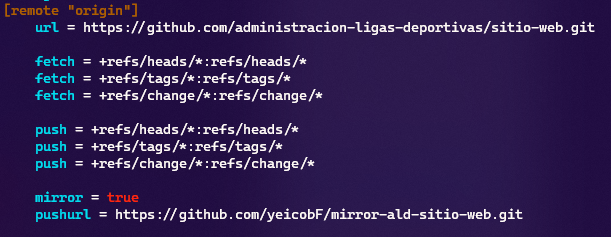

# Administración de Ligas Deportivas: Sitio Web

Sitio Web para el proyecto de Administración de Ligas Deportivas por parte de
la UASLP.

> **_Inicio:_** **Marzo 2022**

## Tecnologías del proyecto

| Categorías                                                 |         Tecnología         |                                     URL                                      |
| :--------------------------------------------------------- | :------------------------: | :--------------------------------------------------------------------------: |
| **Backend**                                                |        **Node.js**         |                      [**Node.js**](https://nodejs.org/)                      |
| **Base de datos**                                          |        **MariaDB**         |                     [**MariaDB**](https://mariadb.com/)                      |
| **Control de Versiones**                                   |          **Git**           |                       [**Git**](https://git-scm.com/)                        |
| **Control de Versiones**                                   |         **GitHub**         |                      [**GitHub**](https://github.com/)                       |
| **Despliegue del Frontend, Infraestructura en la Nube**    |         **Vercel**         |                      [**Vercel**](https://vercel.com/)                       |
| **Frontend, Backend**                                      |        **Next.js**         |                      [**Next.js**](https://nextjs.org/)                      |
| **Frontend**                                               |         **React**          |                      [**React**](https://reactjs.org/)                       |
| **Servicio de Bases de Datos, Infraestructura en la Nube** | **Amazon RDS for MariaDB** | [**Amazon RDS for MariaDB**](https://aws.amazon.com/es/rds/mariadb/pricing/) |
| **TailwindCSS**                                            |      **TailwindCSS**       |                 [**TailwindCSS**](https://tailwindcss.com/)                  |

## Convenciones

### Código

| Herramienta  | Descripción                                                                                                                      |                                  URL                                  |
| :----------- | :------------------------------------------------------------------------------------------------------------------------------- | :-------------------------------------------------------------------: |
| **Airbnb**   | Convenciones de codificación de JavaScript y React de la empresa AirBnB.                                                         | [**GitHub: airbnb/javascript**](https://github.com/airbnb/javascript) |
| **ESLint**   | Lint de código JavaScript: revisión de sintaxis y convenciones de codificación de acuerdo con las reglas de ESLint establecidas. |                   [**ESLint**](https://eslint.org/)                   |
| **Prettier** | Formatter automático de código.                                                                                                  |                 [**Prettier**](https://prettier.io/)                  |

## ESLint + Prettier desde la Terminal

Para ejecutar ESLint y Prettier desde la Terminal podemos utilizar comandos desde la terminal. Esto podría ayudar a revisar que el formato y las reglas de ESLint estén correctas antes de hacer un commit. Incluso para modificar el formato automáticamente antes de subir el commit. De esta manera, no tendríamos que hacer las validaciones manualmente nosotros como desarrolladores por cada archivo.

- Revisa que se cumplan las reglas de ESLint: `npx eslint --fix`
- Modificar formato de acuerdo con Prettier de los archivos que nosotros
  ocupamos (están dentro de carpetas `pages/` y `componentes/`):
  `npx prettier --write pages/ components/`

## Despliegue temporal en plan Hobby de Vercel con Mirror Repo

Actualmente estamos desplegando el proyecto desde el plan Hobby de Vercel en un
repositorio espejo (Mirror) del que se encuentra en la organización
(https://github.com/administracion-ligas-deportivas).

Esto lo hacemos porque no podemos desplegar el repositorio de forma gratuita si
está en una organización, y por el momento no requerimos pagar por el despliegue
porque no hemos implementado funcionalidades de pagos y no tiene que ser de plan
**_Pro_** aún (involucra pagos y la organización de GitHub).

> Enlace del repositorio espejo:
> [yeicobF/mirror-ald-sitio-web](https://github.com/yeicobF/mirror-ald-sitio-web "Mirror Repository del sitio web de Administración de Ligas Deportivas]")

### Pasos a seguir para actualizar Mirror Repo de acuerdo con el Repo original

Hay que seguir una serie de pasos para que el repositorio espejo y el original
estén sincronizados. Por lo que encontramos, no es posible hacerlo de forma
automática. Al menos no sin algún script extra. Este será un procedimiento
temporal, ya que una vez pasemos al plan **_Pro_**, desplegaremos desde el
repositorio original.

> Nosotros seguimos la documentación oficial de GitHub:
>
> [Duplicating a repository: Mirroring a repository in another location](https://github.com/yeicobF/mirror-ald-sitio-web "Duplicating a repository: Mirroring a repository in another location")

1. Abrir la terminal (Git Bash, cmd, zsh, bash, PoweShell, etc.)
2. Creamos un "bare mirror clone" del repositorio original:

   ```bash
   # Ejemplo de la documentación oficial.
   $ git clone --mirror https://github.com/exampleuser/repository-to-mirror.git

   # Implementación en nuestro caso
   $ git clone --mirror https://github.com/administracion-ligas-deportivas/sitio-web.git
   ```

   > La forma de clonar el repositorio dependerá del protocolo que utilicemos
   > (HTTPS, SSH, GitHub CLI)

3. Hacer que la localización del Push sea el repositorio espejo (mirror)

   ```bash
   $ cd repository-to-mirror
   $ git remote set-url --push origin https://github.com/exampleuser/mirrored
   ```

   Tal como dice la
   [documentación oficial](https://docs.github.com/es/repositories/creating-and-managing-repositories/duplicating-a-repository#mirroring-a-repository-in-another-location "Mirroring a repository in another location")
   (puede haber errores de traducción):

   > Tal como con un "bare clone", un "mirrored clone" (clon espejo) inlcuye
   > todas las ramas y tags remotos, pero todas las referencias locales serán
   > sobreescritas cada vez que se haga un `fetch`, por lo que siempre será el
   > que el repositorio original. Establecer el URL para los pushes es una
   > simplifica hacer `push` (subir cambios) al repositorio espejo.

4. En nuestro caso, al haber Pull Request en el repositorio, no nos dejará hacer
   un Push al repositorio espejo, ya que no permite hacerlo si hay Pull
   Requests.

   Lo que hay que hacer es, modificar una serie de configuraciones para que no
   se haga un espejo de los Pull Requests.

   > Las fuentes que se tomaron para los pasos fueron las siguientes:
   >
   > 1. [Git Howto: Mirror a GitHub repo without pull refs](https://christoph.ruegg.name/blog/git-howto-mirror-a-github-repository-without-pull-refs.html "Git Howto: Mirror a GitHub repo without pull refs")
   > 2. [! [remote rejected] errors after mirroring a git repository](https://stackoverflow.com/a/34266401/13562806 "! [remote rejected] errors after mirroring a git repository")

   1. Ejecutamos el comando `git config -e` para abrir la configuración de Git
      en el editor de textos (repository-to-mirror.git/config).
   2. En la sección de `[remote "origin"]`, cambiamos el valor de `fetch` a
      lo siguiente (lo que comience con `fetch`, sobreescribirlo).

      ```bash
      fetch = +refs/heads/*:refs/heads/*
      fetch = +refs/tags/*:refs/tags/*
      fetch = +refs/change/*:refs/change/*
      ```

   3. Agregar las siguientes líneas para `push`.

      ```bash
      push = +refs/heads/*:refs/heads/*
      push = +refs/tags/*:refs/tags/*
      push = +refs/change/*:refs/change/*
      ```

   4. La configuración quedará de la siguiente manera:

      

   5. Guardar los cambios.

5. Hacer `fetch` de las actualizaciones del repositorio original y luego `push`
   de dichas actualizaciones.

   ```bash
   $ git fetch -p origin
   $ git push --mirror
   ```

6. Ahora, si accedemos al
   [repositorio espejo](https://github.com/yeicobF/mirror-ald-sitio-web "yeicobF/mirror-ald-sitio-web"),
   veremos que se ha sincronizado con el repositorio original. En el último
   commit habrá un test del depliegue de **_Vercel_** que podrá ser exitoso o
   no.

   > Si este despliegue tiene éxito, un bot de Vercel agregará una lista de
   > enlaces con la que podemos acceder a un depliegue de preview y producción
   > de la última versión del proyecto de acuerdo con el repositorio. A este
   > preview podemos acceder desde cualquier lugar dispositivo.
